# Capstone Project 
## Project Overview 
This is a Django-based movie review website where users can read, favourite, and submit movie reviews. It has three main apps: blog, profiles, and submit. 
The blog app displays movie reviews, review detail pages, implements a commenting system, as well as favouriting feature. 
The profiles app is for user profile management. Registered users can update their bio and profile pictures and view all their favourited reviews. 
The submit app contains a form for users to submit reviews which the admin can review. 

## Features
### Navigation Bar 
A responsive navigation bar that is consistent on all pages. On larger devices the links are all accessible, whereas on smaller devices the links collapse to ensure better user interface (UI) and better user experience (UX) as well as those links become too crowded and difficult to click on smaller screens. The logo on the left hand side will take you back to the home page for ease.
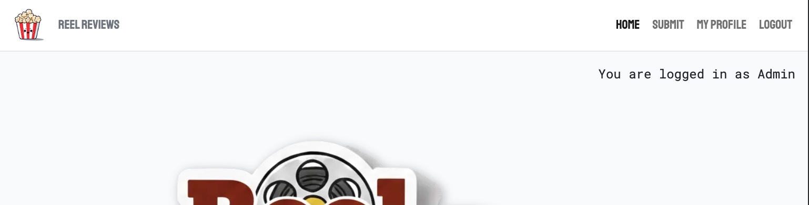 
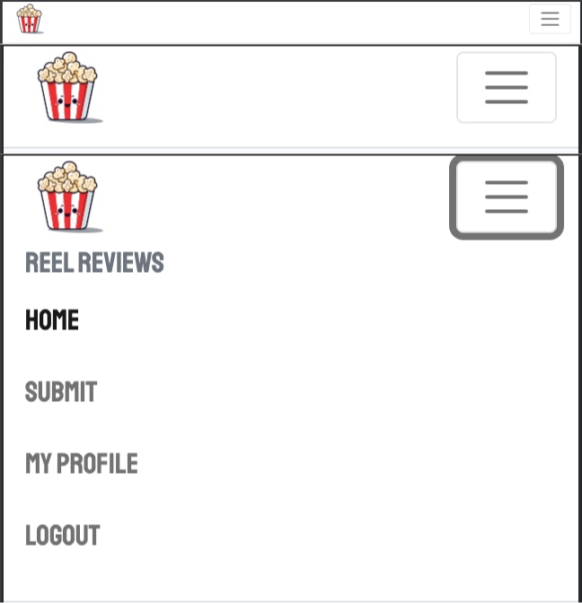

### Login Notification
There is a permanent notice below the navigation bar, specifically underneath the register and login links, to notify users if they are currently logged in or not. 
![screenshot of notification below navigation bar showing whether a user is logged in or not]

The picture that welcomes the users to the site is a logo of the website "Reel Reviews" with a movie reel incorporated to simply and effectively portray the website's topic to the visitor.

Then there are two rows of 3 movie reviews displayed in bootstrap cards. The cards are in a rectangular shape to fit the movie poster dimensions. Below each poster is the review title and a small excerpt of the actual review. Lastly, there is the review's author displayed with a small profile picture, as well as the date the review was uploaded. 
![screenshot of two rows of 3 bootstrap cards that display the movie poster, the review title, review excerpt, author, and upload date]

Below the two rows of reviews there is a next button to continue browsing reviews as well as a footer with social links.
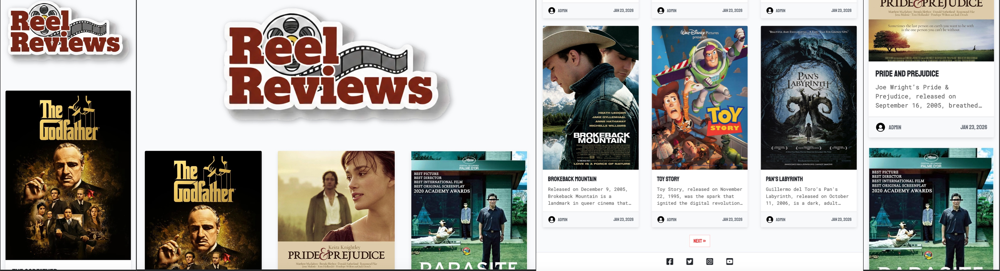

### Submit Page
The submit page contains a photo showing various features of a cinema as well as submission form asking for the user's name, email, and submission with a submit button. Both the photo and form are fully responsive.
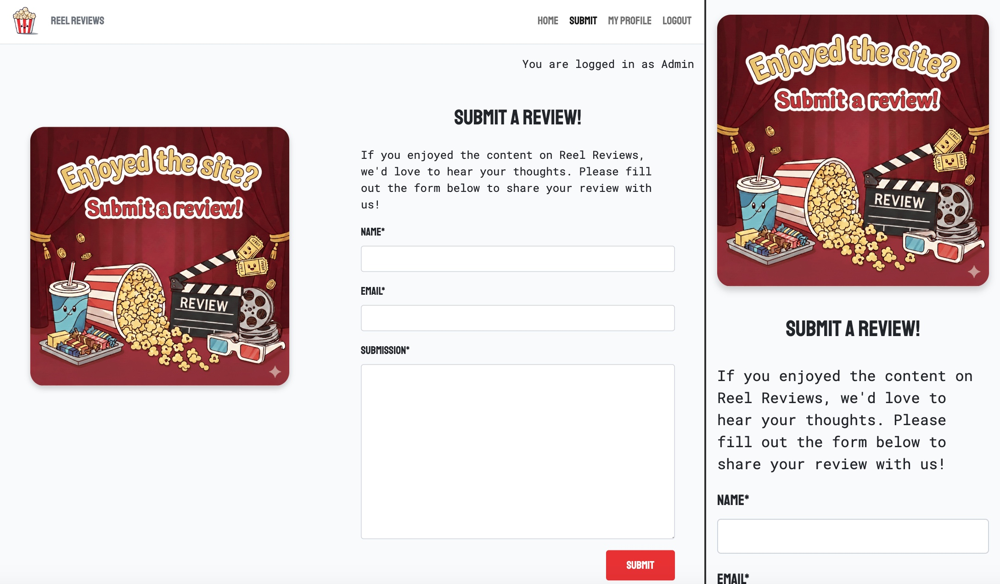

### Profile Page
This page is only accessible if you a registered user and are currently logged. The top section shows your profile picture, username, date of registration, bio, and an edit profile button. The bottom section shows any reviews you have favourited in the same card style as on the home page with an addition of a "remove from favourites" button for ease of use.
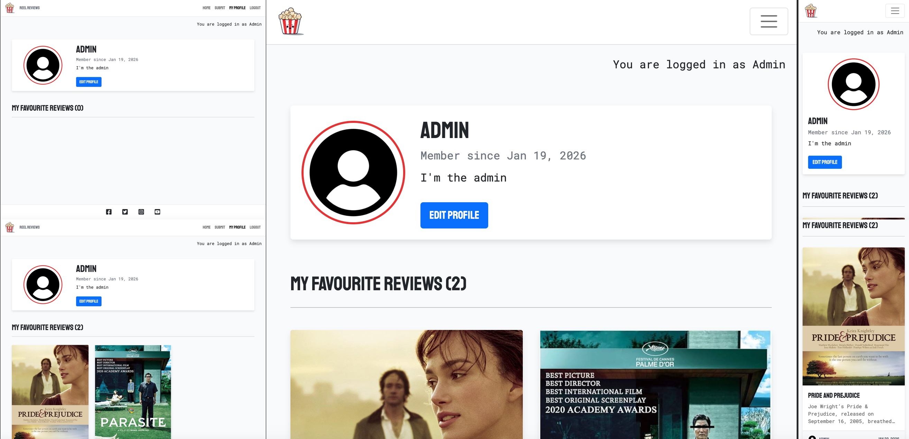

### Edit Profile Page
The edit profile page shows the user's current profile picture. Below there is a text box with their current bio which they can easily edit. Underneath there is a feature to upload any photo the user prefers. As well as a save changes and cancel button so that the user can easily understand whether their changes are permanent.
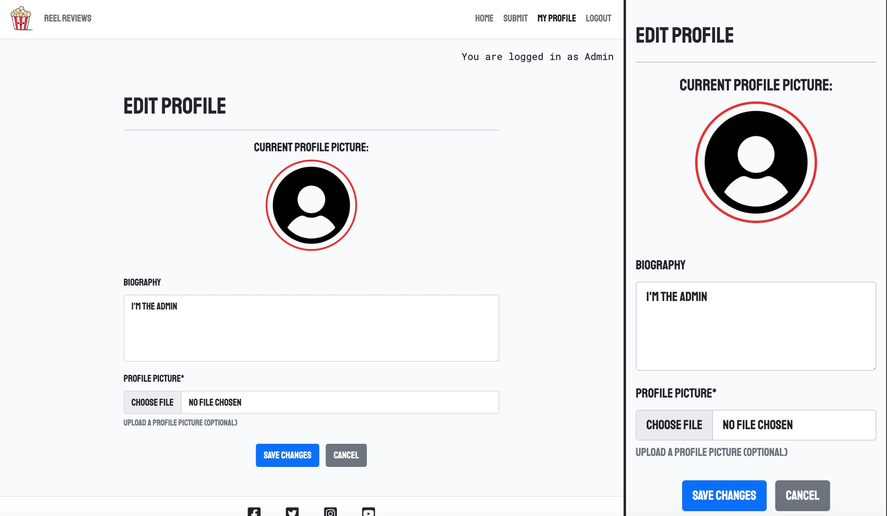

### Review Pages
Each review displays the corresponding movie poster in the masthead beside the title of the review, author, and upload date. The favourite feature is below the review's title, with an add to favourite button which changes to favourited if you a logged in user. It will also notify the user at the top of the page that it has been added to their favourites or removed. Next to the favourite button is a count of how many times this specific review has been favourited by different users. 
Underneath the masthead is the review. Below the review is the comment section that shows already posted by other users (and approved by the admin). There is a "leave a comment" section beside the comments that will only show all of it's features if the user is logged in. Users can only comment text. The logged-in user can also edit and delete their comments. 
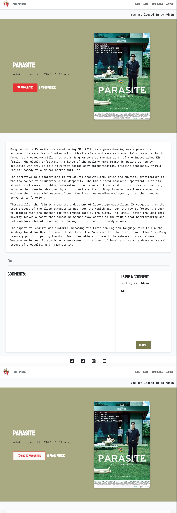
### Register Page
The signup page provides fields for new users to create an account:
1. Username - Unique identifier for the user.
2. Email address - For account verification and communication (optional by default).
3. Password - Secure password field with masking.
4. Password confirmation - Re-enter password to prevent typos.

The form uses built-in validation through django-allauth. The powerful tool checks if the chosen username has already been taken, ensures passwords match, validates email format and password strength, and shows error messages for invalid inputs to clarify to the user where they went wrong.

The first sentence on the page asks users if they already have an account and directs them to the login page instead if they do.
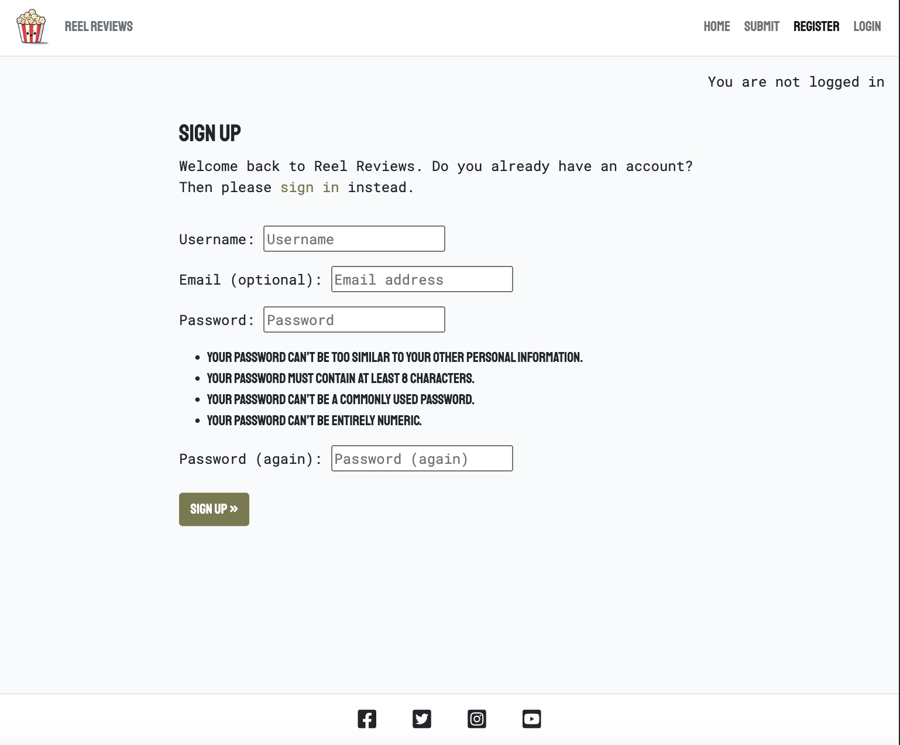

### Login Page
The login page provides a streamlined form for existing users to login with their username and password. There is also an option "Remember Me" feature to stay logged in. This form is also validated through django-allauth. Users are directed to the homepage after successfully logging in and gain immediate access to all features that require authentication (favourites, comments, and profiles).
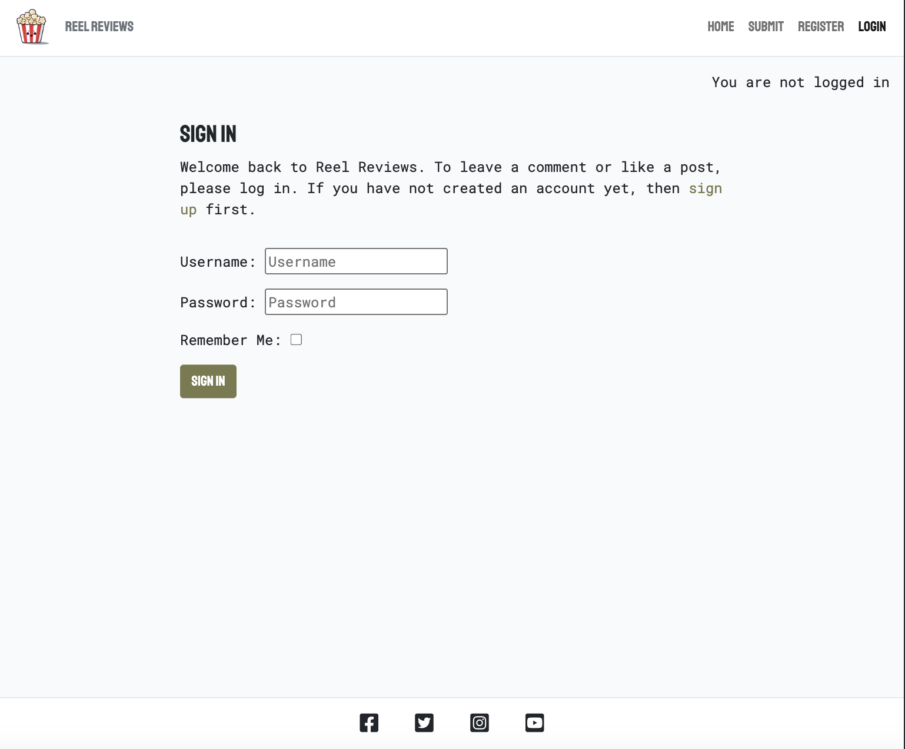

## Additional Features
Fully responsive layout - the site works well on desktop, tablet, and mobile devices
Accessible - the site has been run through an accessibility checker to ensure that is easy to read and that all alt text is included so that there will be no problems with screen readers

## Planning - Wireframes and ERD Diagrams
### Wireframes
I utilised balsamiq to plan the structure and layout of the website as the software is easy to use and creates clear and realistic wireframes. My original mock-ups are very similar to the finished website as I tried to stick to simple front-end features to focus on learning django.
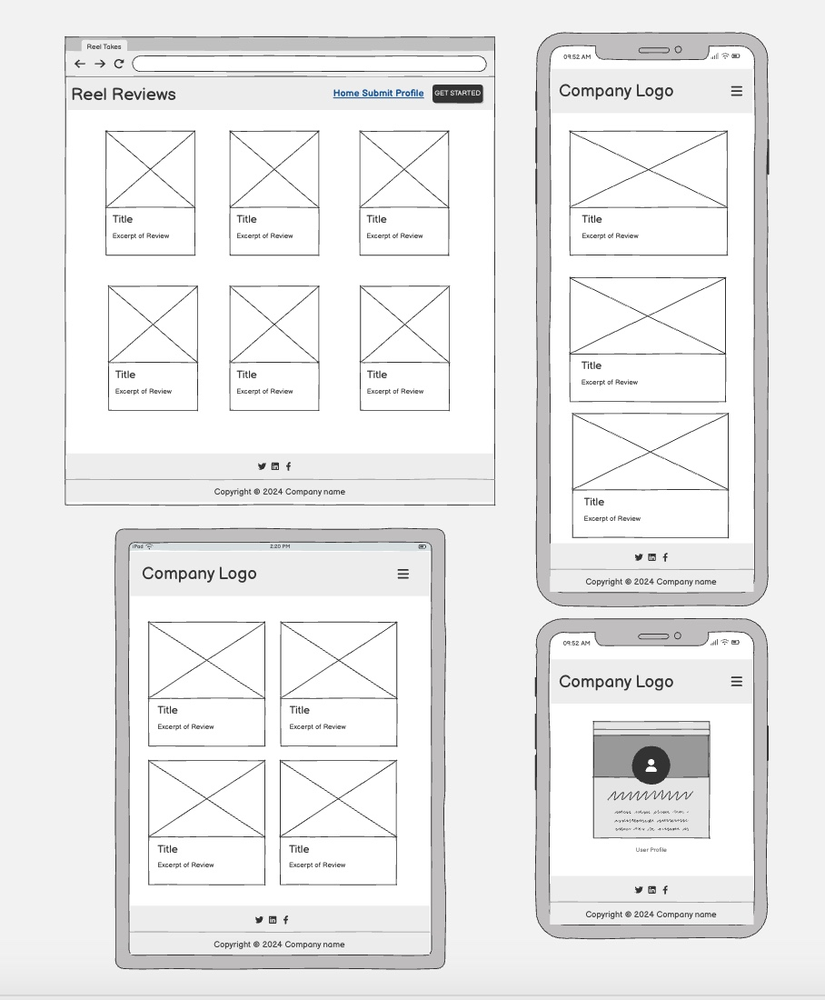

### ERD Diagrams
ERD diagrams are imperative in these type of projects to ensure the data you store is correctly connected. Furthermore, the diagrams helped me to visually realise what information is stored where and helped reduce the amount of mistakes I made.

## Testing 
I tested my forms and views.py by combining unit tests with style checks: I used Django TestCase classes in test_forms.py, test_forms.py, and test_views.py to verify form validation rules, required fields, and expected error messages, then used the Django test Client to send GET/POST requests to view routes and assert status codes, redirects, templates, and context data (for example with assertEqual, assertRedirects, and assertTemplateUsed). After functional testing, I ran pycodestyle (and optionally flake8) on views.py and the rest of the app to confirm PEP 8 compliance, then fixed any reported issues and re-ran checks until the output was clean.

At first, submission records were not being saved because the form handling flow in the submit view had a logic fault, so a successful POST did not persist data as expected. Writing and running automated tests made this visible immediately: a view test sent valid form data to the submit endpoint and then asserted that the database count increased (or that a new object with expected field values existed), but the assertion failed. That failing test confirmed the bug was in the save path rather than in manual input, and after fixing the view/form handling, re-running the same test passed, proving that submission data was now being recorded correctly.

Now all test results pass:
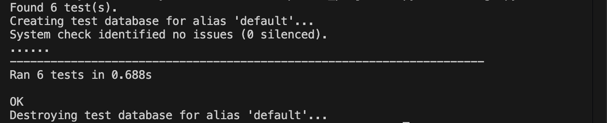

I validated my html and css on validator.w3.org. 

My lighthouse recents were not the best due to the amount of images I have on my website. In the future, I would like to find an alternative solution to fix this.

## Issues
The first issue I encountered was trouble deploying. Whilst following a set-uo guide it can be easy to misread or mistype instructions. Luckily, after reviewing the steps again with fresh eyes, I was able to fix my deployment issue, which was due to a typo in my Procfile.  

Throughout working on the project, I encountered small issues when creating new features naturally. I used CoPilot to identify the problem and then revisited it for help if I couldn’t sort out the problem myself.

I created an ERD diagram for my initial features but didn’t add to it as I added more features. This is something I would do differently next time but as a beginner trying to manage all the different steps was a challenge. Habits that are natural to professionals have to be built up over time and that is the benefit to consistently practicing: creating and refining projects help build that muscle memory.

## AI
CoPilot as a problem solving tool can be very effective. I find it most beneficial when you ask specific questions that have the appropriate context included. I used AI to further explain the steps for creating a new Django app, as well as to help debug my code. This involved feeding it error messages with the prompt to explain the error code as well as provide the solution which is invaluable to a beginner. 

I used AI to help solve the PEP8 guideline issues I had in my code. CoPilot advised me to install pycodestyle and flake8 in my virtual environment. I was then able to check key files in my project for spacing, blank-;ine structure, line-length formatting, trailing whitespace, and minor stye issues such as unnecessary else blocks after return. Copilot helped identify exact violations from pycodestyle, explained each warning in beginner-friendly terms, and guided targeted fixes (for example, correcting top-level function separation and end-of-file newline rules) without changing application behavior. After applying the updates, I re-ran the style checks in the project virtual environment and confirmed the file passed with no remaining PEP 8 errors.
## Future Features
Testing is the optimal time to realise what features need small additions to improve their usability significantly or larger additions to continue to exand the initial inteded purpose of the website. Some examples of small improvements would be to remove the notification "you are not logged in" as new users might find it off-putting; add character limits to the comment and bio sections; restrict submissions to only registered users. Some larger additions include expansion of the profile feature to allow friend requests and messaging to encourage further conversation.

## Deployment
Heroku is the platform used to host this website. The project is connected to GitHub which makes deployment very easy and simple. 

### Required Files
In order to deploy, Heroku needs the following files in your project root:
- **`requirements.txt`** - Lists all Python packages and versions needed
- **`Procfile`** - Tells Heroku how to run your app (contains: `web: gunicorn capstone_project.wsgi`)

### Configuration Steps
Other necessary steps include:
- **Settings.py updates** - Import required packages (`os`, `dj_database_url`)
- **Environment variables** - Set SECRET_KEY, DEBUG, and Cloudinary credentials in Heroku Config Vars
- **Database configuration** - Configure PostgreSQL database with `dj_database_url`
- **WhiteNoise middleware** - Added to MIDDLEWARE for static file serving
- **Static files configuration** - Set STATIC_ROOT and STATICFILES_STORAGE
- **Database migrations** - Run `heroku run python manage.py migrate`
- **GitHub connection** - Connect repository in Heroku Deploy tab

### Deployment Process
1. In your Heroku app dashboard, navigate to the "Deploy" tab
2. Connect to GitHub and select your repository
3. Scroll to "Manual deploy", select your branch (main/master)
4. Click "Deploy Branch"
5. Once deployment completes, click "View" or "Open App" to view your live website

### Post-Deployment
After the first deployment:
- Run migrations: `heroku run python manage.py migrate`
- Create superuser: `heroku run python manage.py createsuperuser`
- Collect static files: `heroku run python manage.py collectstatic --noinput`

The live site is accessible at: https://capstone-project-blog-7fbe8833f003.herokuapp.com/

## Credit
- Previous walkthrough project 
- Django
- Bootsrap v.5 
- Cloudinary
- CoPilot 
- FontAwesome
- Google Images
